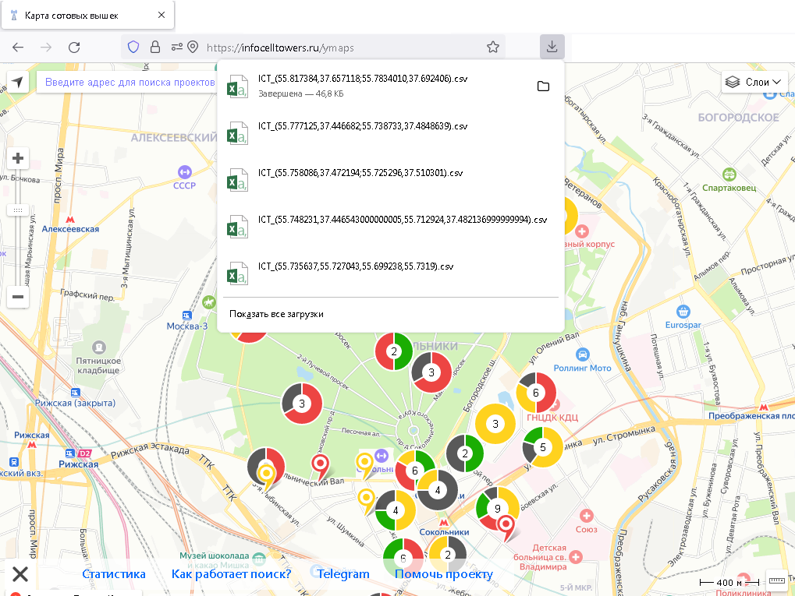
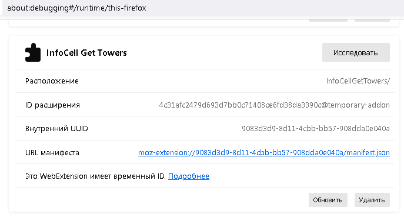

# InfoCells Get Towers плагин для Firefox

**[infocelltowers.ru](https://infocelltowers.ru/) Get Towers** позволяет сохранять полученные сотовые вышки при навигации по карте на сайте.        

Как использовать:
- Добавьте `manifest.json` во временные расширения Firefox'a:
- [about:debugging#/runtime/this-firefox](about:debugging#/runtime/this-firefox)        

You can use **[KMZRebuider](https://github.com/dkxce/KMZRebuilder)** to View and Edit points on the map.   
Для просмотра и редактирования полученных точек на карте вы можете использовать **[KMZRebuider](https://github.com/dkxce/KMZRebuilder)**.    

***P.S**: Чтобы использовать файл csv в SAS.Планете, необходимо поменять кодировку файла в Windows-1251! Сделать это можно с помощью [Блокнота](https://ru.wikipedia.org/wiki/%D0%91%D0%BB%D0%BE%D0%BA%D0%BD%D0%BE%D1%82_(%D0%BF%D1%80%D0%BE%D0%B3%D1%80%D0%B0%D0%BC%D0%BC%D0%B0)),  [Excel](https://www.unisender.com/ru/support/contact-lists/import-contact/charset-utf-8/), [AkelPad](https://akelpad.sourceforge.net/) или [Notepad++](https://notepad-plus-plus.org/downloads/).*    

Другие плагины для Firefox: [CellMapperGetTowers](https://github.com/dkxce/CellMapperGetTowers)    
Другие плагины для [KMZRebuider](https://github.com/dkxce/KMZRebuilder): [InfoCellTowersPlugin](https://github.com/dkxce/InfoCellTowersPlugin)      
Другие плагины для [infocelltowers.ru](https://infocelltowers.ru/): [InfoCellTowersPlugin](https://github.com/dkxce/InfoCellTowersPlugin)  

    
    
